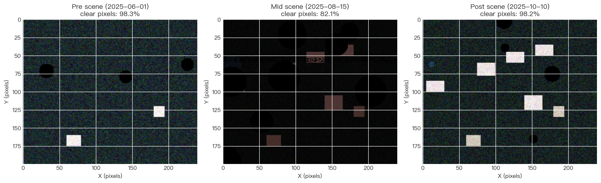
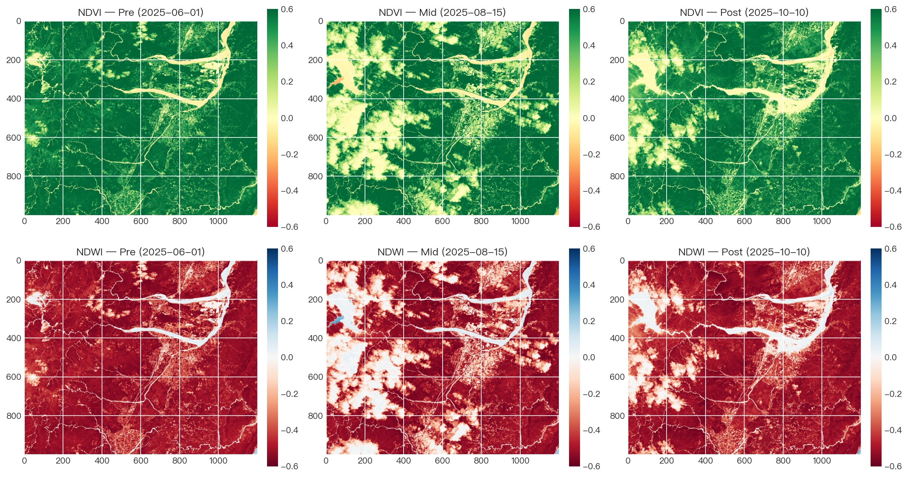
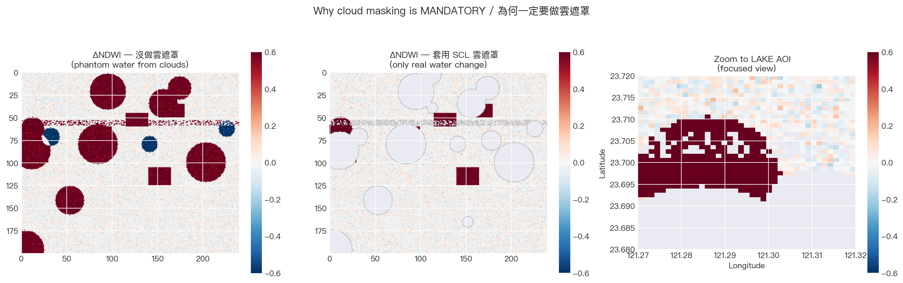
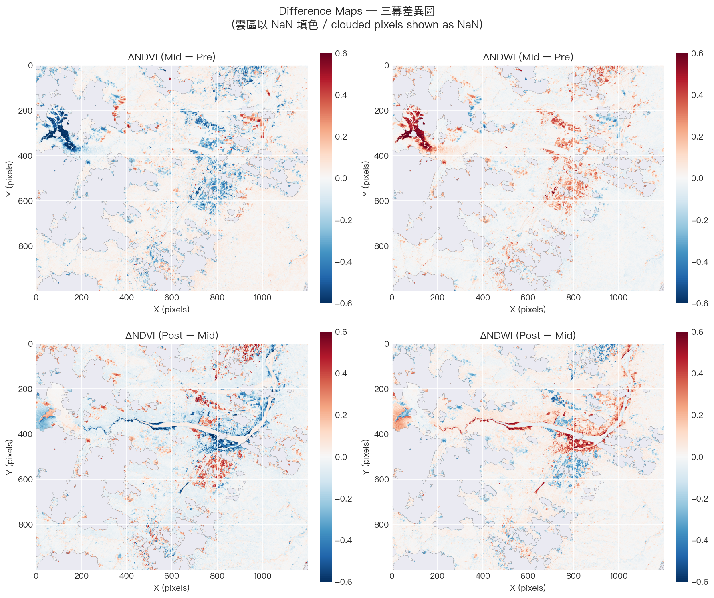
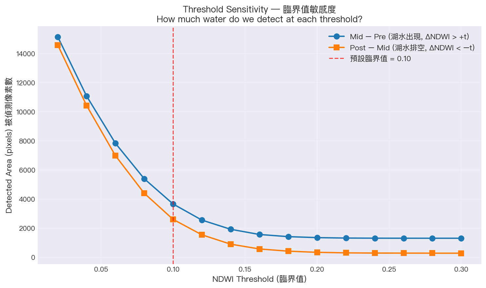
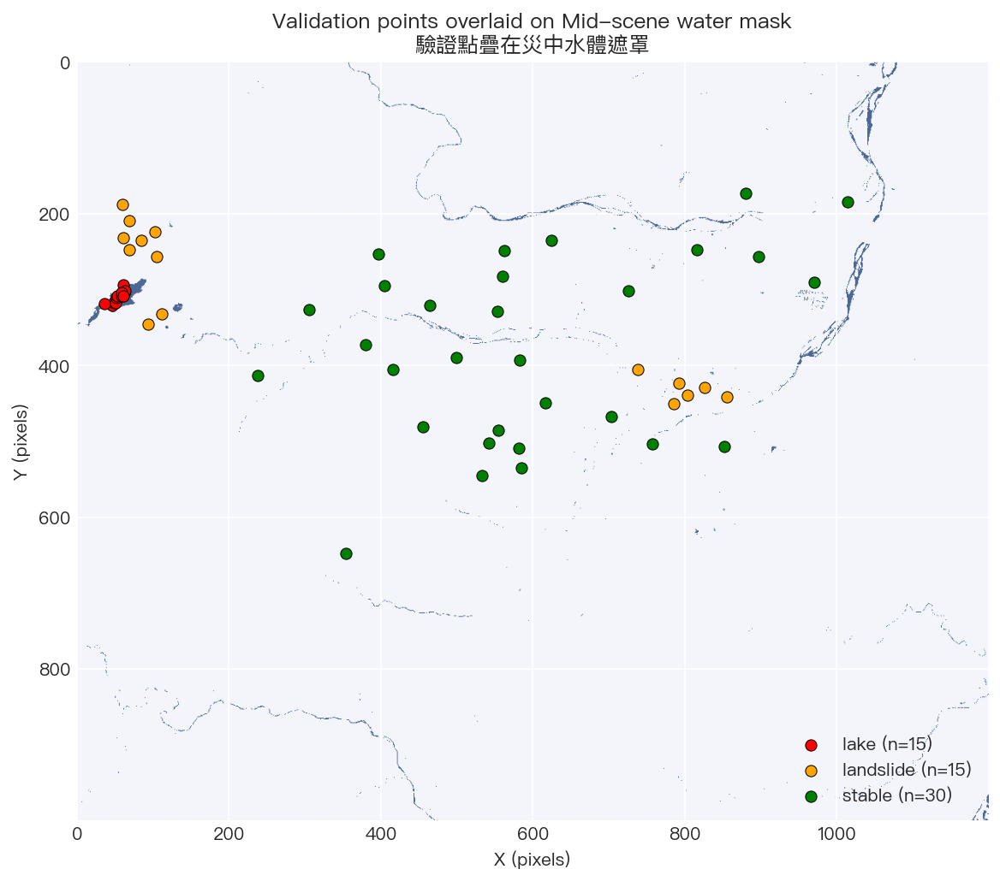
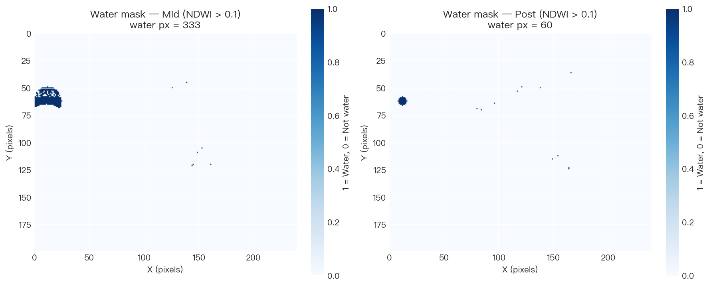
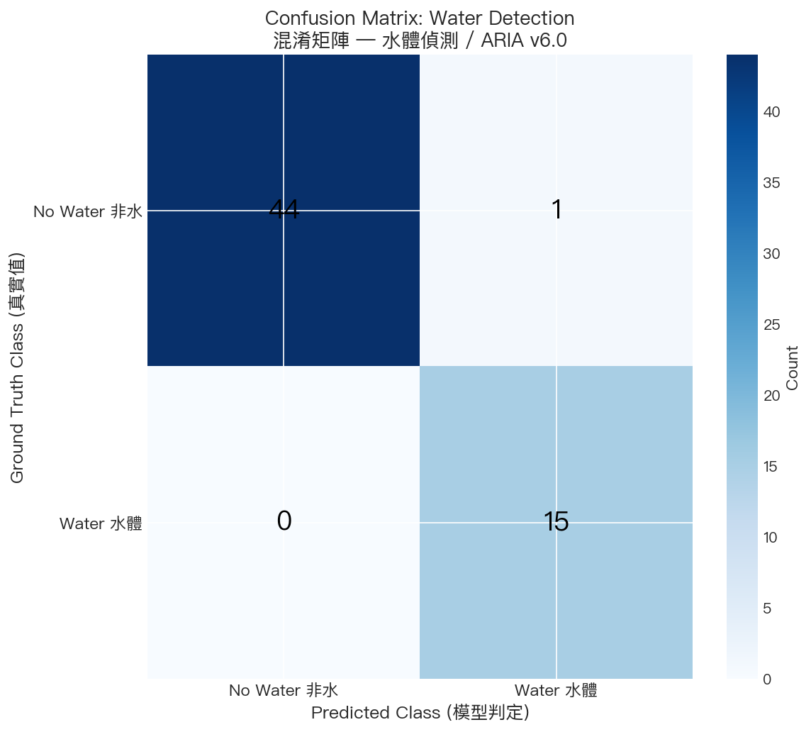
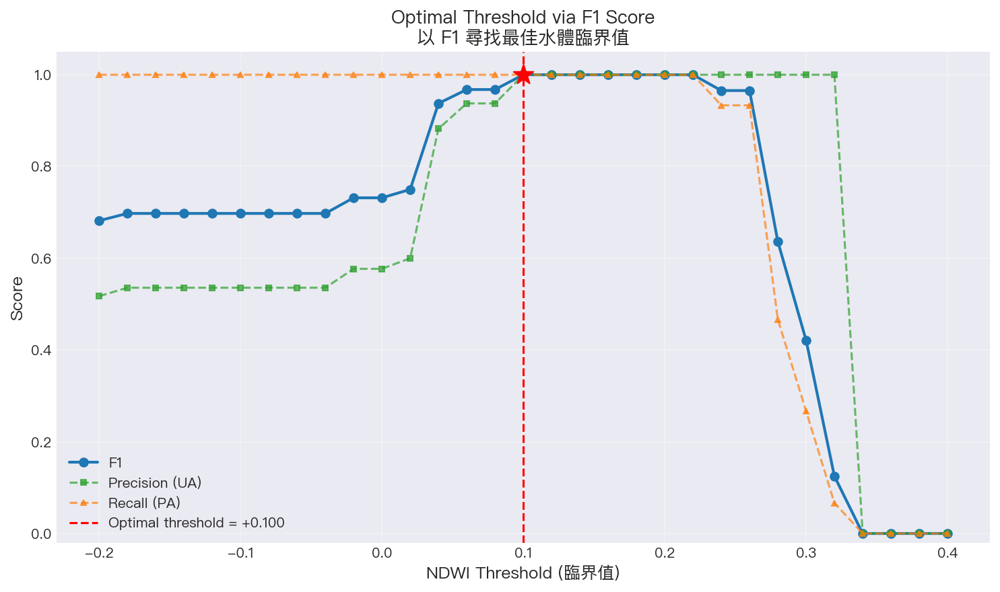
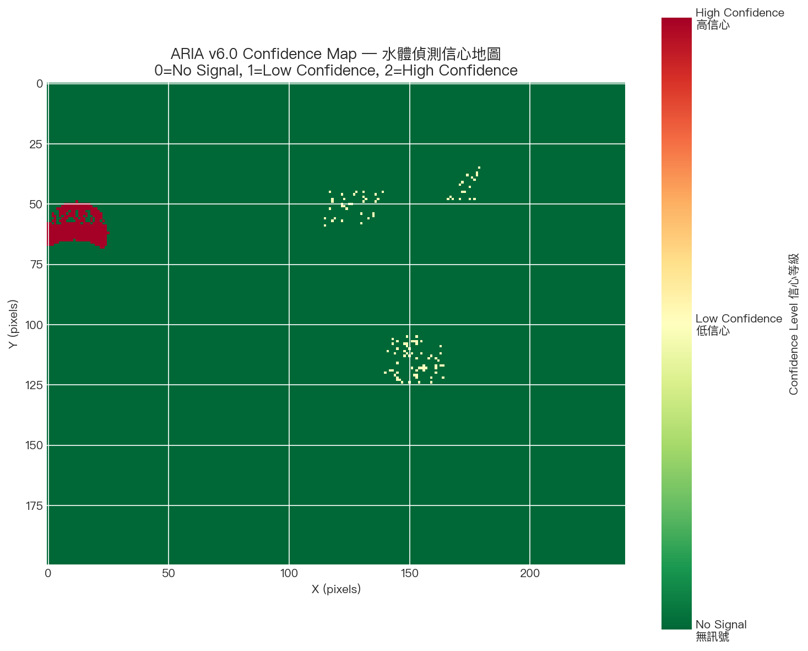

# Exercise 9 — Change Detection & Validation (ARIA v6.0)

NTU 遙測與空間資訊之分析與應用｜Week 9 作業與實作。以 Sentinel-2 前/中/後三期影像進行水體變化偵測，並用 60 個真值點 (15 lake / 15 landslide / 30 stable) 計算 Confusion Matrix、Precision / Recall / F1 與 IoU，完成閾值敏感度分析。

- **Course:** NTU Remote Sensing & Spatial Information Analysis
- **Instructor:** Prof. Su Wen-Ray
- **Week / Theme:** Week 9 — Change Detection & Validation
- **系統代號:** ARIA v6.0 — The Validated Auditor

---

## 專案內容

| 檔案 | 說明 |
|---|---|
| `Week9-Student.ipynb` | 學生主實作 notebook (Lab 1 + Lab 2 + Homework) |
| `Week9-Lab1-PDF.ipynb` | 課堂 PDF 版 Lab 1 參考 notebook |
| `validation_points.geojson` | 60 個驗證真值點 (lake / landslide / stable) |
| `Pre-lab-Week9.md` | 課前準備說明 |
| `Homework-Week9.md` | 本週作業規範 |
| `output/` | 主 notebook 產出的圖 |
| `output_lab1_pdf/` | PDF 版 Lab 1 產出的圖 |

---

## 環境需求

- Python ≥ 3.10
- 必裝：`numpy`, `pandas`, `matplotlib`, `seaborn`, `scikit-learn`, `jupyterlab`, `ipykernel`
- 選用 (線上模式)：`pystac-client`, `planetary-computer`, `pystac`, `odc-stac`
  （§S2 搜尋 Sentinel-2 場景 + §S3.5 載入真實像素；缺任何一個就自動 fallback 成合成場景）

> notebook 用內建 `json` 讀取 `validation_points.geojson`，**不需要** `geopandas / rasterio / gdal`。
> 若不裝 STAC 套件，§S2 會印出 `Mode: SYNTHETIC (offline teaching mode)` 並自動改用合成影像，後續所有分析流程仍可完整跑完。
>
> **線上模式記憶體注意**：§S3.5 以 `ONLINE_RES = 0.0002` (~22 m) 載入，三幕合計約 100 MB。
> 若要降到 ~25 MB，把該常數改為 `0.0004` (~44 m)。

---

## 快速開始 (venv)

```bash
# 1. 進入專案
cd "Exercise 9 Change Detection & Validation"

# 2. 建立 + 啟動 venv
python3 -m venv .venv
source .venv/bin/activate        # Windows: .venv\Scripts\activate

# 3. 安裝套件
pip install --upgrade pip
pip install jupyterlab ipykernel numpy pandas matplotlib seaborn scikit-learn
# 選用：要跑線上模式 (真實 Sentinel-2) 再多裝這四個
pip install pystac-client planetary-computer pystac odc-stac

# 4. 註冊 kernel
python -m ipykernel install --user --name week9-venv --display-name "Python (Week9 venv)"

# 5. 啟動 JupyterLab
jupyter lab Week9-Student.ipynb
```

打開 notebook 後，右上角 Kernel 切到 **"Python (Week9 venv)"** → **Run All**。

---

## 輸出成果

### Lab 1 — 三期影像變化偵測 (`output/`)

| 圖 | 內容 |
|---|---|
|  | 前 / 中 / 後三期 RGB 影像 (Three-Act Structure) |
|  | NDVI、NDWI 指數影像 |
|  | 雲遮罩前後比對 |
|  | ΔNDWI (Mid − Pre, Post − Mid) 差值圖 |
|  | ΔNDWI 閾值敏感度分析 |

### Lab 2 — 驗證與混淆矩陣 (`output/`)

| 圖 | 內容 |
|---|---|
|  | 60 個驗證真值點位置 |
|  | 水體偵測遮罩 |
|  | Confusion Matrix (TP / FP / FN / TN) |
|  | F1 隨閾值變化曲線 |
|  | 偵測信心分布圖 |

### PDF 版 Lab 1 (`output_lab1_pdf/`)

| 圖 | 內容 |
|---|---|
|  | PDF 版 NDVI / NDWI 三期 |
|  | PDF 版差值圖 |
|  | 閾值掃描 |
|  | 最佳閾值遮罩 |

### 其他產出 (`output/`)

- `AI_Advisor_Prompt_Template.txt` — AI 顧問提示詞範本
- `ARIA_v6_0_Disaster_Report.txt` — ARIA v6.0 災害分析報告

---

## 目錄結構

```
Exercise 9 Change Detection & Validation/
├── README.md
├── Week9-Student.ipynb
├── Week9-Lab1-PDF.ipynb
├── validation_points.geojson
├── Pre-lab-Week9.md
├── Homework-Week9.md
├── output/
│   ├── W9_L1_*.png           # Lab 1 圖
│   ├── W9_L2_*.png           # Lab 2 圖
│   ├── AI_Advisor_Prompt_Template.txt
│   └── ARIA_v6_0_Disaster_Report.txt
└── output_lab1_pdf/
    └── PDF_Lab1_*.png
```

---

## 授權 / 聲明

本專案為 NTU 遙測與空間資訊之分析與應用 課程作業。資料與程式碼僅供學術學習使用。
